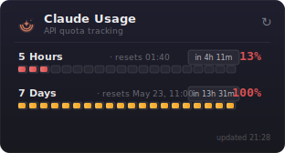

<p align="center">
  
</p>


<h1 align="center">AI Usage Widget</h1>

<p align="center">
  <a href="https://github.com/Muddyblack/kde-ai-usage">
    
  </a>
  
  <a href="LICENSE">
    
  </a>
  
</p>

<p align="center">
  
</p>

A KDE Plasma 6 panel widget for tracking AI API quota usage. Shows your **5-hour session** and **7-day weekly** usage at a glance with animated segmented bars and live countdown timers. Currently supports Claude (Anthropic).

---

## Features

- **Panel view** — two compact percentage readouts in the taskbar, color-coded by usage level
- **Popup view** — segmented bars showing exact fill level for both windows, with reset times and countdowns
- **Live countdowns** — ticks down in real time, shows "resetting..." when the window flips
- **Color thresholds** — amber at 70%, red at 90%
- **Auto-refresh** — polls every 5 minutes, reads credentials directly from `~/.claude/.credentials.json`
- **Stale indicator** — dims if the last fetch failed, shows error inline
- **Rate-limit backoff** — respects `retry-after` headers, won't hammer the API

---

## Requirements

| Dependency | Notes |
|---|---|
| KDE Plasma 6.0+ | `X-Plasma-API-Minimum-Version: 6.0` |
| `plasma5support` | Provides the `executable` DataEngine for reading credentials |
| Claude Code | Logged-in session required — credentials read from `~/.claude/.credentials.json` |

---

## Install

### Manual (any distro)

```bash
git clone https://github.com/Muddyblack/kde-ai-usage.git
cd kde-ai-usage
kpackagetool6 -t Plasma/Applet -i package
# or to update an existing install:
kpackagetool6 -t Plasma/Applet -u package
```

Then right-click your panel → *Add Widgets* → search **"AI Usage"**.

To remove:

```bash
kpackagetool6 -t Plasma/Applet -r org.muddyblack.aiUsageWidget
```

### Development / test install

```bash
./test_install.sh
```

Installs as `AI Usage (Test)` alongside the real widget so you can iterate without touching your live install.

To remove the test copy:

```bash
kpackagetool6 -t Plasma/Applet -r org.muddyblack.aiUsageWidgetTest
```

### NixOS (flake)

```nix
# flake.nix
{
  inputs.ai-usage.url = "github:Muddyblack/kde-ai-usage";

  outputs = { self, nixpkgs, ai-usage, ... }: {
    nixosConfigurations.mybox = nixpkgs.lib.nixosSystem {
      modules = [
        ({ pkgs, ... }: {
          environment.systemPackages = [
            ai-usage.packages.${pkgs.system}.default
          ];
        })
      ];
    };
  };
}
```

### Package as `.plasmoid`

```bash
./pack.sh
# produces ai-usage-widget-<version>.plasmoid
```

---

## How it works

On each refresh cycle the widget reads `~/.claude/.credentials.json` to get the OAuth access token, then calls the Anthropic usage API. The response contains two rolling windows — a 5-hour session window and a 7-day weekly window — each with a utilization percentage and a reset timestamp.

No credentials are stored or transmitted anywhere other than the official Anthropic API endpoint.

---

## Releasing

```bash
./tag.sh
```

Prompts for a version bump (patch / minor / major), updates `package/metadata.json`, commits, tags, and pushes. CI then builds the `.plasmoid` and creates a GitHub release automatically.
